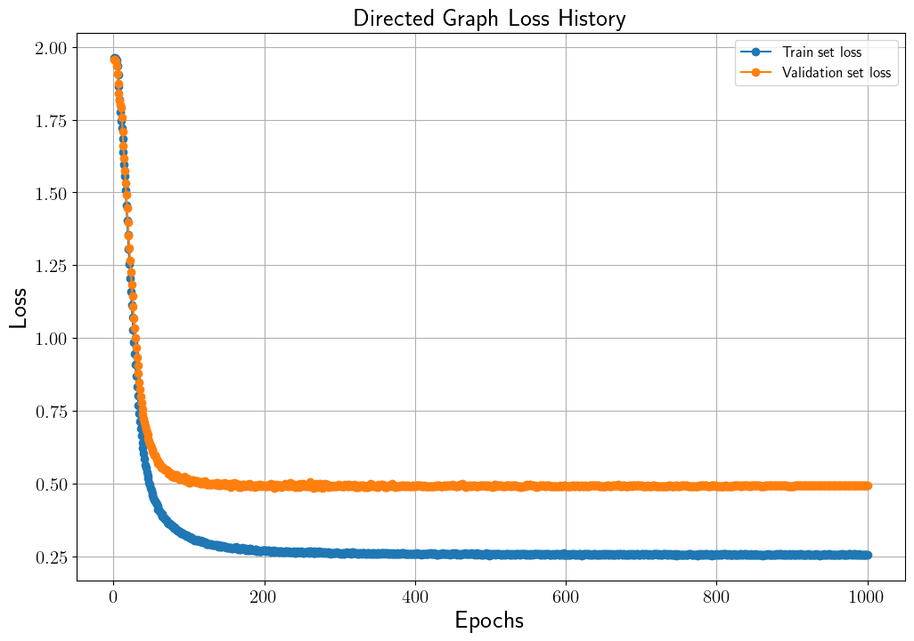
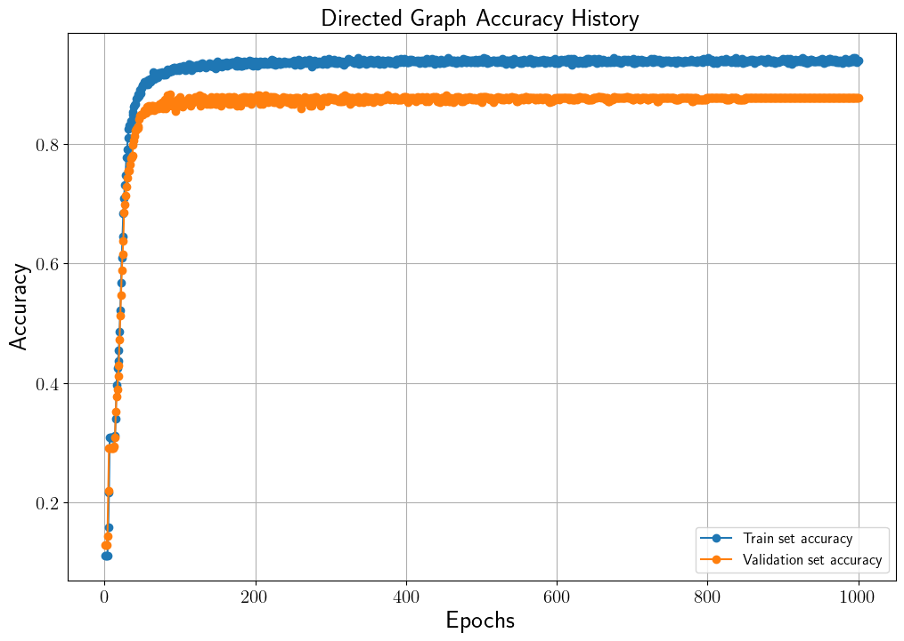
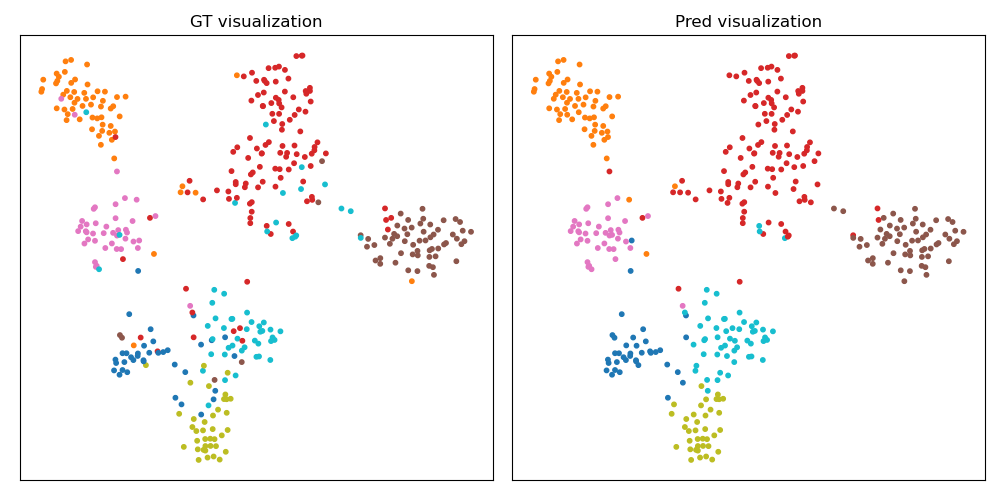
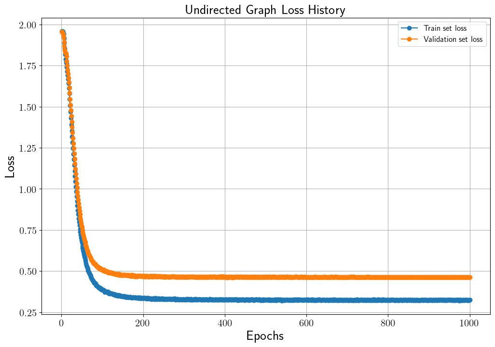
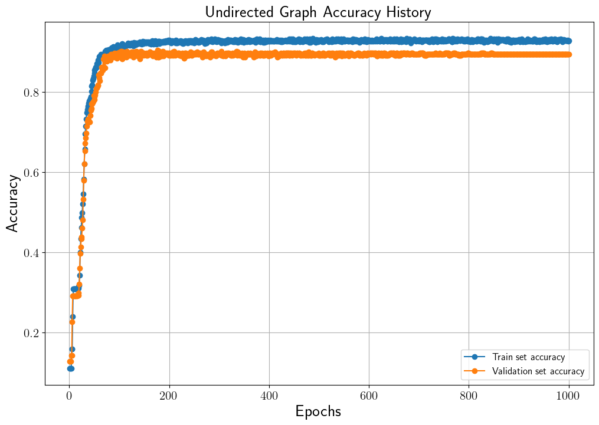
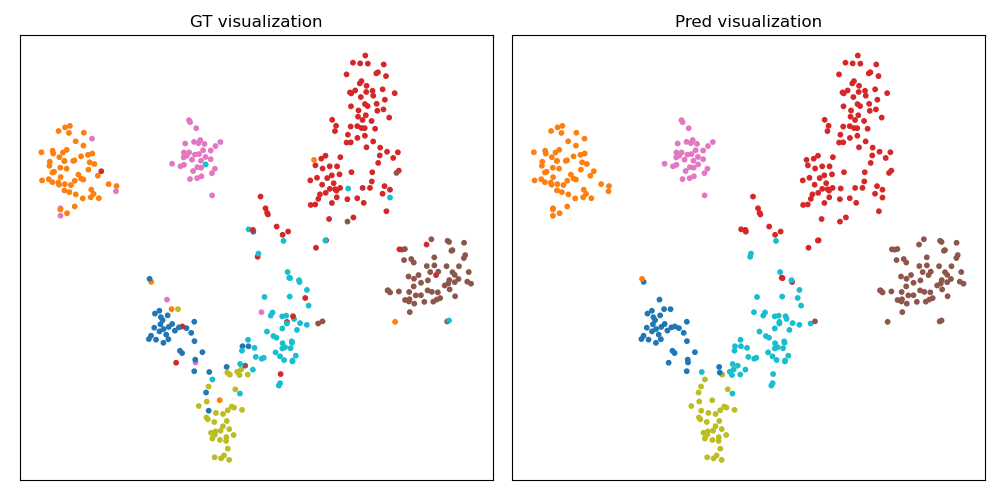

# Paper Category Classification using Graph Convolutional Networks
## 설명
Node classification은 Graph Neural Networks (GNN)을 활용하여 풀 수 있는 task 중 하나입니다.
본 코드는 [Cora](https://relational.fit.cvut.cz/dataset/CORA)의 논문 인용 graph 데이터와 Graph Convolutional Networks (GCN)을 이용하여 unlabeled 된 논문(graph node)의 카테고리를 예측합니다.
뿐만 아니라 학습된 graph node feature의 분포를 t-SNE를 통해 가시화합니다.
본 코드의 자세한 설명은 [Cora 데이터와 GCN을 이용한 노드 분류](https://ljm565.github.io/contents/gnn2.html)을 참고하시기 바랍니다.
<br><br><br>

## 모델 종류
* ### Graph Convolutional Networks (GCN)
    [Cora](https://relational.fit.cvut.cz/dataset/CORA)의 graph 데이터를 사용하여 GCN 모델을 학습하여 논문(graph node)의 카테고리를 예측합니다.
    본 코드는 pytorch-geometric, deep graph library를 사용하지 않고 naive한 방법으로 구현합니다.
<br><br><br>


## 사용 데이터
* ### [Cora Dataset](https://relational.fit.cvut.cz/dataset/CORA)
<br><br>


## 사용 방법
* ### 학습 방법
    학습을 시작하기 위한 argument는 4가지가 있습니다.<br>
    * [-d --device] {cpu, gpu}, **필수**: 학습을 cpu, gpu로 할건지 정하는 인자입니다.
    * [-m --mode] {train, test}, **필수**: 학습을 시작하려면 train, 학습된 모델을 가지고 있어서 test set의 결과와 학습된 특징 분포를 가시화 하고싶은 경우에는 test로 설정해야합니다. test 모드를 사용할 경우, [-n, --name] 인자가 **필수**입니다.
    * [-c --cont] {1}, **선택**: 학습이 중간에 종료가 된 경우 다시 저장된 모델의 체크포인트 부분부터 학습을 시작할 수 있습니다. 이 인자를 사용할 경우 -m train 이어야 합니다. 
    * [-n --name] {name}, **선택**: 이 인자는 -c 1 혹은 -m {test} 경우 사용합니다.
    중간에 다시 불러서 학습을 할 경우 모델의 이름을 입력하고, test를 할 경우에도 실험할 모델의 이름을 입력해주어야 합니다(최초 학습시 src/config.json에서 정한 모델의 이름의 폴더가 형성되고 그 폴더 내부에 모델 및 모델 파라미터가 json 파일로 형성 됩니다).<br><br>

    터미널 명령어 예시<br>
    * 최초 학습 시
        ```
        python3 src/main.py -d cpu -m train
        ```
    * 중간에 중단 된 모델 이어서 학습 시
        <br>주의사항: config.json을 수정해야하는 일이 발생 한다면 base_path/src/config.json이 아닌, base_path/src/model/{model_name}/{model_name}.json 파일을 수정해야 합니다.
        ```
        python3 src/main.py -d gpu -m train -c 1 -n {model_name}
        ```
    * 최종 학습 된 모델의 test set에 대한 결과를 확인할 시
        <br>주의사항: config.json을 수정해야하는 일이 발생 한다면 base_path/src/config.json이 아닌, base_path/src/model/{model_name}/{model_name}.json 파일을 수정해야 수정사항이 반영됩니다.
        ```
        python3 src/main.py -d cpu -m test -n {model_name}
        ```
    <br><br>

* ### 모델 학습 조건 설정 (config.json)
    **주의사항: 최초 학습 시 config.json이 사용되며, 이미 한 번 학습을 한 모델에 대하여 parameter를 바꾸고싶다면 base_path/src/model/{model_name}/{model_name}.json 파일을 수정해야 합니다.**
    * base_path: 학습 관련 파일이 저장될 위치.
    * model_name: 학습 모델이 저장될 파일 이름 설정. 모델은 base_path/src/model/{model_name}/{model_name}.pt 로 저장.
    * loss_data_name: 학습 시 발생한 loss data를 저장하기 위한 이름 설정. base_path/src/loss/{loss_data_name}.pkl 파일로 저장. 내부에 중단된 학습을 다시 시작할 때, 학습 과정에 발생한 loss 데이터를 그릴 때 등 필요한 데이터를 dictionary 형태로 저장.
    * directed: {0, 1} 중 선택. 0의 경우 undirected graph, 1일 경우 directed graph로 구성.
    * dynamic: {0, 1} 중 선택. 0의 경우 adjacency matrix를 $D^{-1}A$로 정규화, 1일 경우 $D^{-1/2}AD^{-1/2}$로 정규화
    * hidden_dim: GCN의 hidden dimension.
    * dropout: 모델의 dropout 비율.
    * epochs: 학습 epoch 설정.
    * lr: learning rate 지정.
    * early_stop_criterion: Validation set의 최소 loss를 내어준 학습 epoch 대비, 설정된 숫자만큼 epoch이 지나도 나아지지 않을 경우 학습 조기 종료.
    * visualize_file_name: Test set의 학습된 feature 그림 저장할 이름.
    <br><br><br>


## 결과
* ### Directed Graph 학습 결과
    * Loss History<br>
    <br><br>

    * Accuracy History<br>
    <br><br>
    

    * Test set accuracy: 0.8600 (87 epoch)<br>
    (Validation set의 가장 높은 accuracy를 달성했을 때 모델의 test set 결과)<br><br>

    * 학습된 Test set Feature Distribution<br>
    <br><br>


* ### Undirected Graph 학습 결과
    * Loss History<br>
    <br><br>

    * Accuracy History<br>
    <br><br>
    
    아래 결과는 validation set의 가장 높은 accuracy를 달성했을 때 모델의 test set 결과입니다.

    * Test set accuracy: 0.8771 (177 epoch)<br>
    (Validation set의 가장 높은 accuracy를 달성했을 때 모델의 test set 결과)<br><br>

    * 학습된 Test set Feature Distribution<br>
    <br><br>

<br><br>

## 기타
본 코드는 pytorch-geometric, deep graph library를 사용하지 않고 naive하게 구현한 모델입니다. 따라서 data loader (or sampler)등을 구현하지 않았기에 batch로 학습하지 않았습니다.


<br><br><br>
