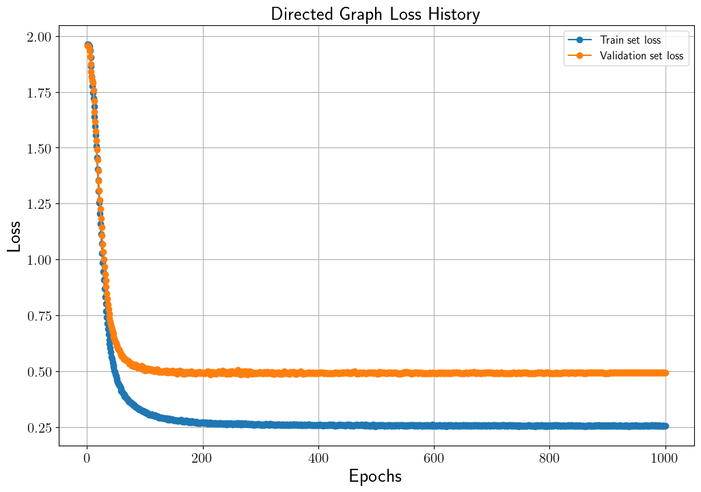
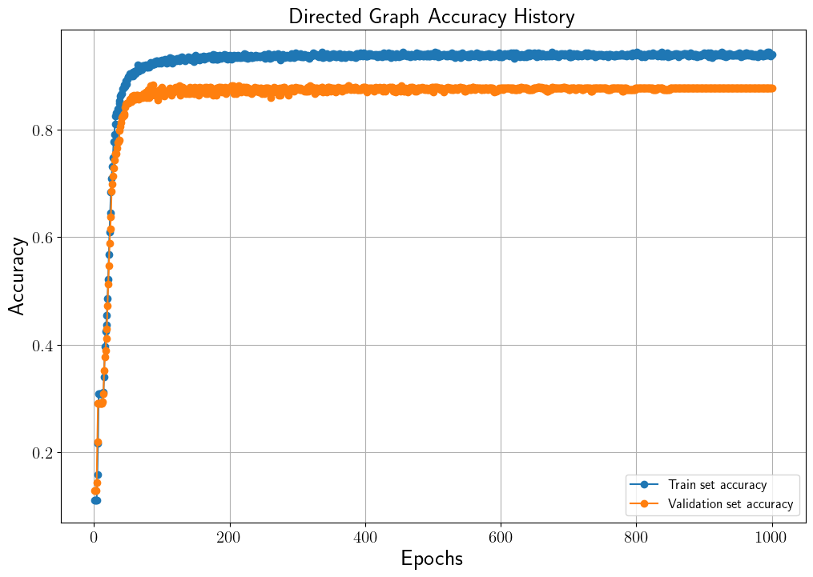
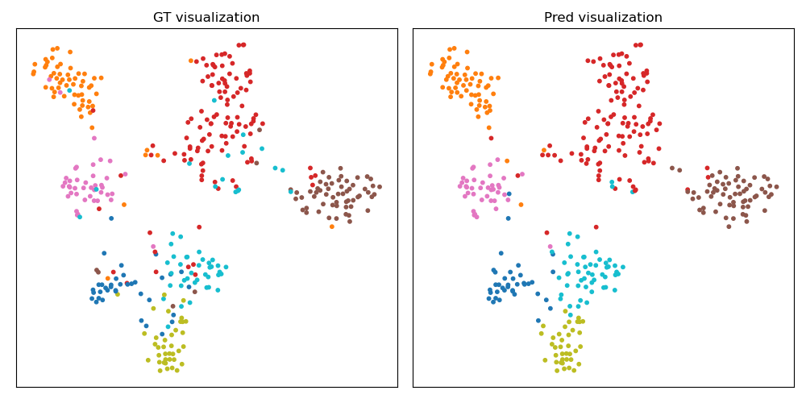
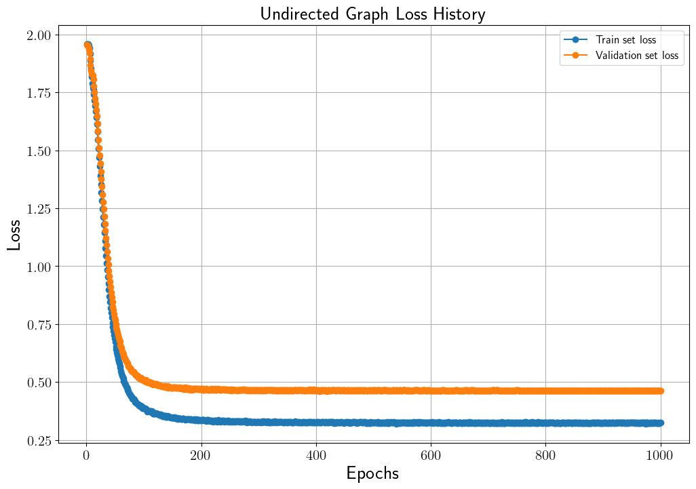
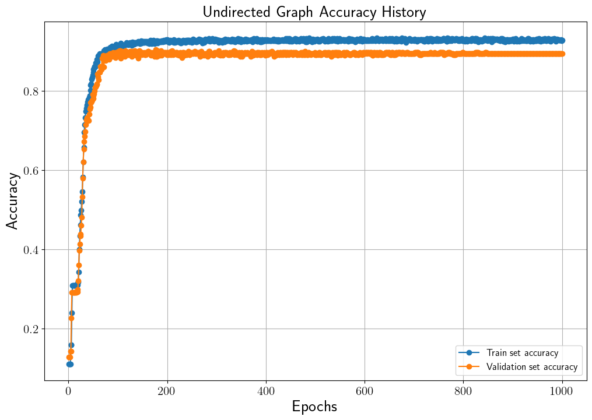
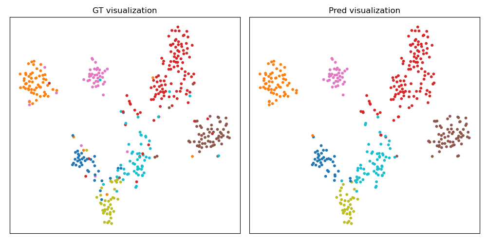

# Paper Category Classification using Graph Convolutional Networks

## Introduction
Node classification은 Graph Neural Networks (GNN)을 활용하여 풀 수 있는 task 중 하나입니다.
본 코드는 [Cora](https://relational.fit.cvut.cz/dataset/CORA)의 논문 인용 graph 데이터와 Graph Convolutional Networks (GCN)을 이용하여 unlabeled 된 논문(graph node)의 카테고리를 예측합니다.
뿐만 아니라 학습된 graph node feature의 분포를 t-SNE를 통해 가시화합니다.
본 코드의 자세한 설명은 [Cora 데이터와 GCN을 이용한 노드 분류](https://ljm565.github.io/contents/gnn2.html)을 참고하시기 바랍니다.
<br><br><br>

## Supported Models
### Graph Convolutional Networks (GCN)
* `nn.Linear`을 이용한 GCN 모델이 구현되어 있습니다(본 코드는 pytorch-geometric, deep graph library를 사용하지 않고 naive한 방법으로 구현합니다).
<br><br><br>


## Base Dataset
* [Cora Dataset](https://relational.fit.cvut.cz/dataset/CORA).
* Custom 데이터는 `config/config.yaml`에 데이터 경로를 입력해야합니다. 그리고 `src/trainer/build.py`에 custom data를 처리하는 코드를 구현해야합니다.
<br><br><br>


## Supported Devices
* CPU, GPU (DDP is not supported), MPS (for Mac and torch>=1.12.0)
<br><br><br>

## Quick Start
```bash
python3 src/run/train.py --config config/config.yaml --mode train
```
<br><br>

## Project Tree
본 레포지토리는 아래와 같은 구조로 구성됩니다.
```
├── configs                         <- Config 파일들을 저장하는 폴더
│   └── *.yaml
│
└── src      
    ├── models
    |   └── gcn.py                  <- GCN 모델 파일
    |
    ├── run                   
    |   ├── train.py                <- 학습 실행 파일
    |   ├── validation.py           <- 학습된 모델 평가 실행 파일
    |   └── vis_tsne.py             <- 학습된 모델 t-SNE 가시화 실행 파일
    | 
    ├── tools                   
    |   ├── model_manager.py          
    |   └── training_logger.py      <- Training logger class 파일
    |
    ├── trainer                 
    |   ├── build.py                <- Dataset, dataloader 등을 정의하는 파일
    |   └── trainer.py              <- 학습, 평가 등을 수행하는 class 파일
    |
    └── uitls                   
        ├── __init__.py             <- Logger, 버전 등을 초기화 하는 파일
        ├── data_utils.py           <- 그래프 데이터 전처리 파일
        ├── filesys_utils.py       
        └── training_utils.py     
```
<br><br>

## Tutorials & Documentations
GCN 모델을 학습하기 위해서 다음 과정을 따라주시기 바랍니다.

1. [Getting Started](./1_getting_started_ko.md)
2. [Data Preparation](./2_data_preparation_ko.md)
3. [Training](./3_training_ko.md)
4. ETC
   * [Evaluation](./4_model_evaluation_ko.md)
   * [Predicted Feature Visualization using t-SNE](./5_tsne_vis_ko.md)

<br><br><br>

## Training Results
### Directed Graph Trained Results
* Loss History<br>
<br><br>

* Accuracy History<br>
<br><br>


* Test set accuracy: 0.8600 (87 epoch)<br>
(Validation set의 가장 높은 accuracy를 달성했을 때 모델의 test set 결과)<br><br>

* Test set Feature Distribution<br>
<br><br>


### Undirected Graph 학습 결과
* Loss History<br>
<br><br>

* Accuracy History<br>
<br><br>

아래 결과는 validation set의 가장 높은 accuracy를 달성했을 때 모델의 test set 결과입니다.

* Test set accuracy: 0.8771 (177 epoch)<br>
(Validation set의 가장 높은 accuracy를 달성했을 때 모델의 test set 결과)<br><br>

* Test set Feature Distribution<br>
<br><br>

<br><br>

## ETC
본 코드는 pytorch-geometric, deep graph library를 사용하지 않고 naive하게 구현한 모델입니다. 따라서 data loader (or sampler)등을 구현하지 않았기에 batch로 학습하지 않았습니다.


<br><br><br>
